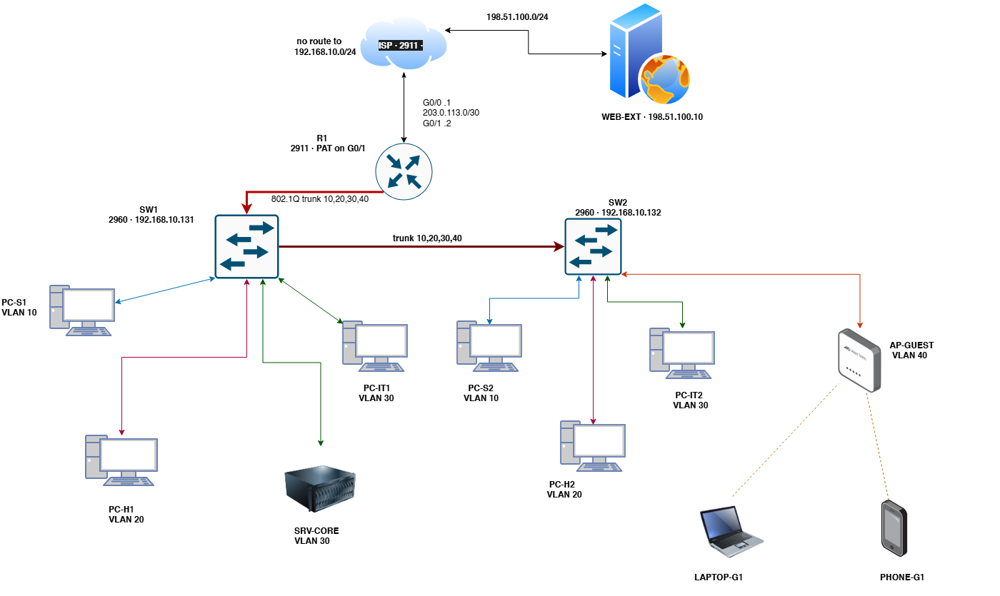

# Four-VLAN Office Network: Cisco Packet Tracer

> Designed a 4-VLAN office network in Packet Tracer (inter-VLAN routing, DHCP, DNS, NAT, ACLs); injected and resolved 6 faults with documented root cause and fix.

**Status:** baseline v1.0 built and verified; fault write-ups in progress.
**Packet Tracer version:** `9.0.1`. The `.pkt` files need Packet Tracer 9.0 or newer to open.

## What's in it

- **4 VLANs:** Sales 10, HR 20, IT 30 and Guest Wi-Fi 40, each a /26 of `192.168.10.0/24`
- **Inter-VLAN routing:** router-on-a-stick on R1 (802.1Q subinterfaces)
- **Central DHCP + DNS** on one server, with DHCP relayed to the other VLANs by `ip helper-address`
- **NAT (PAT)** to a simulated ISP that has no route back to private space
- **Guest ACL:** DHCP and DNS allowed, Sales/HR/IT denied, internet allowed
- **Port security:** sticky with max 1 on wired ports, max 10 on the AP uplink

## Topology



Source: [`diagrams/topology.drawio`](diagrams/topology.drawio) (draw.io).

## IP plan

| VLAN | Name | Subnet | Gateway | DHCP range |
|---|---|---|---|---|
| 10 | SALES | 192.168.10.0/26 | .1 | .11–.60 |
| 20 | HR | 192.168.10.64/26 | .65 | .75–.124 |
| 30 | IT | 192.168.10.128/26 | .129 | .140–.189 |
| 40 | GUEST | 192.168.10.192/26 | .193 | .200–.249 |

Full plan: [docs/ip-plan.md](docs/ip-plan.md). Validate it with `python tools/ipplan.py`.

## Verification

**22 of 22 tests pass**, including 5 negative tests where the traffic must be blocked (guest isolation). Full results, with the observed output for each test, are in [tests/verification-matrix.md](tests/verification-matrix.md).

Highlights:
- Every host leases from its own VLAN's pool; HR, Sales and Guest leases are relayed across the router to one central server.
- `show ip nat translations` shows inside addresses translated to the single public address 203.0.113.2, and the ISP has no route back to 192.168.10.0/24.
- Guests reach the internet but not Sales, HR or IT; blocked pings are refused by their own gateway (192.168.10.193), which is the ACL at work.
- A rogue laptop on SW1 Fa0/1 put the port into `err-disable` with a violation count of 1.

## Fault write-ups

| # | Layer | Fault | Write-up | Challenge file |
|---|---|---|---|---|
| F1 | L2 access | Wrong VLAN on a port | *to do* | *to do* |
| F2 | L2 trunk | VLAN missing from trunk | *to do* | *to do* |
| F3 | L3 boundary | No DHCP relay | *to do* | *to do* |
| F4 | L3 host | Wrong default gateway | *to do* | *to do* |
| F5 | L4 policy | ACL blocks too much | *to do* | *to do* |
| F6 | L7 | Bad DNS record | *to do* | *to do* |

Each write-up covers the symptom, the commands run (with real output), the root cause, the fix, verification and prevention. The template is in [faults/TEMPLATE.md](faults/TEMPLATE.md).

## Repository layout

```
docs/          requirements, IP plan, design decisions
configs/       running-configs exported from the devices + server/endpoint GUI settings
tests/         verification matrix T01–T22
faults/        write-up template and the six fault write-ups
packet-tracer/ baseline .pkt + six challenge .pkt files
diagrams/      topology.drawio + topology.png
screenshots/   evidence referenced by tests and write-ups
tools/         ipplan.py
```

## How to open

1. Install Cisco Packet Tracer (the version above or newer) from Cisco Networking Academy.
2. Open `packet-tracer/office-baseline-v1.0.pkt` to see the working network.
3. Open any `packet-tracer/faults/F0N-*.pkt` to try a fault yourself, then compare with its write-up.

## What I learned

<!-- After P6: 3–5 bullets, for example what scope told you about the layer of a fault. -->

## Roadmap (after v1.0)

SSH and hardening · DHCP snooping + DAI · NTP/syslog/TFTP backups · EtherChannel · L3 core switch + OSPF · IPv6 dual-stack · rebuild on real IOS (CML/GNS3) with Python checks.
