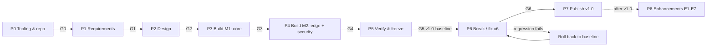

# Execution Plan — Four-VLAN Office Network (Cisco Packet Tracer)

> **The resume line this project has to make true:**
> *Designed a 4-VLAN office network in Packet Tracer (inter-VLAN routing, DHCP, DNS, NAT, ACLs); injected and resolved 6 faults with documented root cause and fix.*

---

## 0. At a glance

**MVP = v1.0 = everything the resume line claims, built the simplest correct way.** That means one edge router doing router-on-a-stick and PAT, two access switches, one central server for DHCP and DNS, guest Wi-Fi behind an ACL, port security on every access port, and six injected faults with write-ups. Anything smaller can't be published, because the resume line claims all of it. Everything past that is an enhancement (§9) and goes on its own branch after v1.0 ships.

| Phase | Name | Effort | Exit gate |
|---|---|---|---|
| P0 | Tooling & repo | 1–2 h | **G0**: PT opens and the repo skeleton is pushed |
| P1 | Requirements | 1–2 h | **G1**: every requirement (FR/NFR) and success criterion is written and mapped to a test |
| P2 | Design | 2–3 h | **G2**: `tools/ipplan.py` passes and the topology and port map are drawn |
| P3 | Build M1: core | 3–4 h | **G3**: every wired host gets the right lease, pings across VLANs and resolves `intranet.office.test` |
| P4 | Build M2: edge + security | 2–3 h | **G4**: internet works through PAT, guest isolation holds and a port-security violation is shown |
| P5 | Verify & freeze | 1–2 h | **G5**: T01–T22 recorded, configs exported, tag `v1.0-baseline` |
| P6 | Break / fix ×6 | 4–6 h | **G6**: six write-ups with real evidence, and regression passes after each fix |
| P7 | Publish | 3–4 h | **G7**: repo public with the README complete, tag `v1.0` |
| P8 | Enhancements | 1–4 h each | Regression passes on each branch before it's merged |

**MVP total: about 17–26 hours.** At ~2 h/day that's two weeks: P0–P4 in week 1 and P5–P7 in week 2.

### Repo layout (already scaffolded)

```
README.md                         GitHub landing page; fill it in as phases finish
docs/PLAN.md                      this plan
docs/requirements.md              P1 output: stakeholders, FR/NFR, success criteria, traceability
docs/ip-plan.md                   P2 output: source of truth for VLANs, subnets, ports, DNS
docs/design-decisions.md          P2 output: why each design choice was made
configs/R1.txt SW1.txt SW2.txt ISP.txt   starter configs in sections [M1] [M2] [E1]
configs/servers-and-endpoints.md  GUI settings: SRV-CORE, WEB-EXT, AP, PCs
tests/verification-matrix.md      P5: T01–T22 with result + evidence columns
faults/README.md                  fault catalog: inject / trigger / restore / expected path
faults/TEMPLATE.md                write-up template (copy once per fault)
tools/ipplan.py                   validates the IP plan
diagrams/  packet-tracer/  screenshots/
```

---

## 1. Phase 0: Tooling & environment

### Required

| Tool | Used for | Notes |
|---|---|---|
| **Cisco Packet Tracer 8.2.x or newer** | Simulation | Free through Cisco Networking Academy (enroll in *Getting Started with Cisco Packet Tracer* to reach the download). **Put your exact version in the README.** A `.pkt` saved in a newer PT won't open in an older one. |
| **Git + GitHub account** | Version control, publishing | `.pkt` is binary, and `.gitattributes` already marks it that way. |
| **VS Code** (or any Markdown editor) | Docs | GitHub renders the Mermaid diagram in §14. |
| **diagrams.net / draw.io desktop** | Clean topology diagram | Commit both `diagrams/topology.drawio` and the exported `topology.png`. |
| **Python 3** | `tools/ipplan.py` | Already installed on this machine. |
| **Win + Shift + S** | Evidence screenshots | Name them like `screenshots/F03-show-ip-int.png`. |

### Optional (enhancements only)

- **Cisco Modeling Labs Free / GNS3 / EVE-NG**: real IOS images (E7).
- **Wireshark**: real captures of 802.1Q tags, DHCP `giaddr` and NAT (E7). PT has no pcap export, so use Simulation mode in PT instead.
- **Python Netmiko / pyATS**: automated pre-/post-change checks (E7).

### Packet Tracer settings to change once

- *Options → Preferences → Interface*: tick **Always Show Port Labels in Logical Workspace**. Screenshots then document themselves.
- After cabling or config changes, press **Fast Forward Time** in the bottom bar. STP then turns ports from amber to green immediately instead of after about 30 s.
- *Simulation mode → Edit Filters*: while debugging, keep only **ARP, DHCP, DNS, HTTP, ICMP**.

### Study refreshers (Jeremy's IT Lab, free CCNA course on YouTube)

| Topic | Day |
|---|---|
| Subnetting (VLSM) | 13–15 |
| VLANs: access ports, trunks, router-on-a-stick, native VLAN, SVIs | 16–18 |
| DTP / VTP | 19 |
| Standard & extended ACLs | 34–35 |
| DNS · DHCP | 38 · 39 |
| SSH | 42 |
| NAT (static, dynamic, PAT) | 44–45 |
| Port security · DHCP snooping · DAI | 49 · 50 · 51 |

His **CCNA Mega Lab** is a good self-check before P6.

### Steps

```bash
cd "Project 1"
git init -b main
git add .
git commit -m "Scaffold: plan, requirements, IP plan, starter configs"
# Create an empty repo called office-network-lab on github.com, then:
git remote add origin https://github.com/<your-user>/office-network-lab.git
git push -u origin main
```

**Deliverables:** PT installed with its version noted, and the repo skeleton pushed (it can stay private until P7).

---

## 2. Phase 1: Requirements gathering

There's no real client in a lab, so **role-play one.** Interviewers do ask how you gathered requirements. "I wrote a customer brief, interviewed the stakeholders and turned the answers into testable requirements" is a strong answer.

### Steps

1. **Customer brief.** Write one paragraph describing a fictional 60-person, single-floor office with two wiring closets, Sales/HR/IT staff and visitors who need Wi-Fi. A draft is already in `docs/requirements.md`.
2. **Stakeholder map + interview questions.** Answer each question in character.

   | Stakeholder | Cares about | Ask |
   |---|---|---|
   | Office manager (sponsor) | Cost, uptime, guest impression | Headcount per department now and in 2 years? How much downtime is acceptable? Budget? |
   | Sales lead | Internet and SaaS always up | Which apps? When are peak hours? Do people change desks? |
   | HR lead | Confidentiality | Who must never reach HR systems? Any compliance rules? |
   | IT admin | Manageability | How are devices managed and backed up? What IP and naming conventions? |
   | Guests | Easy Wi-Fi, internet only | How many at once? Is a shared password acceptable? |
   | **Reviewer / hiring manager** (the real audience) | Evidence of skill | Can I open it? Can I follow the troubleshooting? Is the output real? |

3. **Numbered requirements.** Turn the answers into FR-xx (functional) and NFR-xx (non-functional).
4. **Boundaries.** Record constraints, assumptions and what's out of scope.
5. **Success criteria.** Make them measurable (SC1–SC6).
6. **Traceability matrix.** Map each FR to where it's implemented and which test proves it. **An FR without a test isn't done.**
7. **Gate G1:** re-read the brief, check every stakeholder concern has a requirement or an explicit "out of scope", then commit.

**Deliverable:** `docs/requirements.md`. The filled draft is a starting point, so rewrite it in your own voice.

---

## 3. Phase 2: Network design

### 3.1 Topology

```
                     [WEB-EXT 198.51.100.10]   "the internet"
                               | 198.51.100.0/24
                             [ISP]  2911: no route to 192.168.10.0/24 (on purpose)
                               | 203.0.113.0/30   .1 ISP G0/0  <->  .2 R1 G0/1 (ip nat outside)
                             [R1]  2911: G0/0.10 .20 .30 .40 (router-on-a-stick), PAT, GUEST-IN
                               | 802.1Q trunk, allowed 10,20,30,40
      [SW1 2960  .131] ----------------------------------- [SW2 2960  .132]
       Fa0/1  PC-S1     V10       trunk Gi0/2 <-> Gi0/1      Fa0/1  PC-S2     V10
       Fa0/7  PC-H1     V20                                  Fa0/7  PC-H2     V20
       Fa0/13 SRV-CORE  V30  DHCP + DNS + HTTP  .130         Fa0/13 PC-IT2    V30
       Fa0/14 PC-IT1    V30                                  Fa0/19 AP-GUEST  V40 ))) LAPTOP-G1, PHONE-G1
```

Why two switches: with one switch, "VLAN missing from the trunk" could only break the router link, which takes the whole VLAN down. With a switch-to-switch trunk, the fault breaks HR **on one switch only**, and that difference in scope is exactly what the diagnosis has to notice.

### 3.2 Addressing (one /24 → four /26)

| VLAN | Name | Subnet | Gateway (R1) | Usable | DHCP range |
|---|---|---|---|---|---|
| 10 | SALES | 192.168.10.0/26 | .1 | .1–.62 | .11–.60 |
| 20 | HR | 192.168.10.64/26 | .65 | .65–.126 | .75–.124 |
| 30 | IT | 192.168.10.128/26 | .129 | .129–.190 | .140–.189 |
| 40 | GUEST | 192.168.10.192/26 | .193 | .193–.254 | .200–.249 |

Mask 255.255.255.192, wildcard 0.0.0.63. Static and reserved addresses, the port map and DNS records are in `docs/ip-plan.md`. **Validate it:** `python tools/ipplan.py` must print `OK`.

### 3.3 Switching

- VTP **transparent** on both switches, so VLANs are created on purpose on each switch and a stray VTP update can't delete them.
- Trunks carry an **explicit allowed list** (`10,20,30,40`). Fault F2 depends on this.
- Port blocks are the same on every switch: Fa0/1–6 Sales · Fa0/7–12 HR · Fa0/13–18 IT · Fa0/19–20 Guest AP · Fa0/21–24 unused.
- STP stays at defaults because the topology has no loop. E4 adds a redundant link.
- The native VLAN stays at 1 in the MVP. E1 moves it to an unused VLAN 999.

### 3.4 Routing

- All four LAN subnets are **directly connected** on R1, so inter-VLAN routing needs no routing protocol.
- One **static default route** to the ISP: `ip route 0.0.0.0 0.0.0.0 203.0.113.1`.
- **No dynamic routing protocol in v1.** With a single router there's nobody to exchange routes with. OSPF becomes worthwhile in E5, when an L3 core switch sits behind R1.
- The ISP has **no route back to 192.168.10.0/24**. Replies only come home because PAT rewrites them to 203.0.113.2, and test T14 proves NAT is doing that work.

### 3.5 Services

- **DHCP:** one server (SRV-CORE, 192.168.10.130) with four pools. Sales, HR and Guest DHCP requests are relayed by `ip helper-address` on G0/0.10, .20 and .40. There's **no helper on .30**, because the server is in that VLAN and hears the broadcasts directly.
- **DNS:** same server. `intranet.office.test → 192.168.10.130` and `www.example.com → 198.51.100.10`.
- **HTTP:** a staff-only intranet page on SRV-CORE and an "internet" page on WEB-EXT.

### 3.6 Security

**Write the guest policy in plain words first, then the ACL:**

> Guests may get an address (DHCP) and resolve names (DNS to 192.168.10.130).
> Guests may not reach the Sales, HR or IT subnets. Everything else (the internet) is allowed.

```
ip access-list extended GUEST-IN          ! applied INBOUND on G0/0.40, as close to the source as possible
 10 permit udp any any eq 67                                       ! DHCP (broadcast + unicast renew)
 20 permit udp 192.168.10.192 0.0.0.63 host 192.168.10.130 eq 53   ! DNS to SRV-CORE only
 30 deny   ip 192.168.10.192 0.0.0.63 192.168.10.0   0.0.0.63      ! -> Sales
 40 deny   ip 192.168.10.192 0.0.0.63 192.168.10.64  0.0.0.63      ! -> HR
 50 deny   ip 192.168.10.192 0.0.0.63 192.168.10.128 0.0.0.63      ! -> IT
 60 permit ip 192.168.10.192 0.0.0.63 any                          ! -> internet
```

Side effect to document as intended behavior: staff **can't ping guests** either, because the guest's reply enters on G0/0.40 and is dropped (T22).

**Port-security profiles**

| Ports | Profile | Why |
|---|---|---|
| Fa0/1–18 (wired users + server) | `maximum 1`, `mac-address sticky`, `violation shutdown` | One known device per desk port; a swapped-in device err-disables the port |
| Fa0/19–20 (AP uplink) | `maximum 10`, `violation restrict`, no sticky | Every wireless client's MAC shows up on this port, so max 1 would kill guest Wi-Fi on the second client |

### 3.7 NAT

PAT (overload) onto G0/1's address. `access-list 1 permit 192.168.10.0 0.0.0.255` covers all four VLANs.

### 3.8 Design decisions

Record them in `docs/design-decisions.md`: router-on-a-stick vs. an L3 switch, server placement, ACL placement, PAT, VTP mode, trunk lists, port-security profiles, documentation address ranges. A draft is already there.

**Deliverables:** `docs/ip-plan.md` (validated), `docs/design-decisions.md`, `diagrams/topology.drawio` + `.png` (v1), port map.

---

## 4. Phase 3: Build M1 (core connectivity)

### 4.1 Place and cable devices

| Device | PT model | Connects to |
|---|---|---|
| R1 | 2911 | G0/0 → SW1 Gi0/1 (straight); G0/1 → ISP G0/0 (cross-over, M2) |
| SW1, SW2 | 2960-24TT | SW1 Gi0/2 → SW2 Gi0/1 (cross-over) |
| SRV-CORE | Server-PT | SW1 Fa0/13 |
| PC-S1 · PC-H1 · PC-IT1 | PC-PT | SW1 Fa0/1 · Fa0/7 · Fa0/14 |
| PC-S2 · PC-H2 · PC-IT2 | PC-PT | SW2 Fa0/1 · Fa0/7 · Fa0/13 |
| ISP, WEB-EXT, AP-GUEST, LAPTOP-G1, PHONE-G1, ROGUE | see M2 | |

Rename every device's display name to match the table, because screenshots are evidence. If you'd rather not pick cables, the "Automatically Choose Connection Type" cable (lightning bolt) chooses correctly.

### 4.2 Configure the switches

On each switch, type `enable` and paste the **[M1]** section of `configs/SW1.txt` or `configs/SW2.txt`. Check the result:

```
SW1# show vlan brief            ! VLANs 10/20/30/40 exist; ports sit in the right VLAN
SW1# show interfaces trunk      ! Gi0/1 and Gi0/2 trunking; allowed 10,20,30,40
```

### 4.3 Configure R1

Paste the **[M1]** section of `configs/R1.txt`. Check it:

```
R1# show ip interface brief     ! G0/0 and G0/0.10/.20/.30/.40 up/up
R1# show ip route               ! four C routes for the /26s
```

### 4.4 Configure SRV-CORE

Configure the static IP, four DHCP pools, DNS records and intranet page exactly as in `configs/servers-and-endpoints.md`. Two PT gotchas: **DNS is off by default**, and the default **`serverPool` can't be deleted**, so turn it into the IT pool.

### 4.5 Switch the PCs to DHCP

On each PC, set *Desktop → IP Configuration → DHCP*. If a PC shows "DHCP request failed", press Fast Forward Time and click DHCP again.

### 4.6 Checkpoint M1 (Gate G3)

Run **T01–T03, T05–T10 and T21** from `tests/verification-matrix.md`. Then save `packet-tracer/M1-core.pkt` and commit with the message `M1: VLANs, trunks, inter-VLAN routing, DHCP relay, DNS`.

---

## 5. Phase 4: Build M2 (edge + security)

1. **ISP + WEB-EXT.** Paste `configs/ISP.txt`, then set up WEB-EXT per `servers-and-endpoints.md`.
2. **R1 WAN + PAT + default route.** Paste R1 section **[M2] WAN + PAT**. Check it:
   `ping 198.51.100.10` from PC-H1, then on R1 run `show ip nat translations` and `show ip nat statistics`.
3. **Guest Wi-Fi.** Set up AP-GUEST on SW2 Fa0/19, then LAPTOP-G1 (swap in the WPC300N module) and PHONE-G1 per `servers-and-endpoints.md`.
4. **Guest ACL.** Paste R1 section **[M2] Guest isolation**. **Test both directions straight away:** T15 must pass, and T16–T18 must fail.
5. **Port security.** Paste the **[M2]** section on both switches. Generate traffic from every host (`ipconfig /renew` or a ping), then check:
   `show port-security address` should show one sticky MAC per used wired port. Run `write memory` so the sticky MACs survive a reload.
6. **Checkpoint M2 (Gate G4).** Run **T04, T11–T20 and T22**. Save `packet-tracer/M2-edge-security.pkt` and commit.

---

## 6. Phase 5: Verification & baseline freeze

### 6.1 Procedure (bottom-up, the same order you'll troubleshoot in)

| Layer | Command | Pass when |
|---|---|---|
| L1 | `show ip interface brief` (R1), `show interfaces status` (switches) | up/up; connected |
| L2 | `show cdp neighbors` | cabling matches the port map |
| L2 | `show vlan brief` | every used port is in its planned VLAN |
| L2 | `show interfaces trunk` **on both ends** | trunking; allowed `10,20,30,40` on both sides |
| L2 | `show mac address-table` | host MACs learned in the expected VLAN and port |
| L3 | `show ip route` | 4 × C /26, 1 × C /30, `S* 0.0.0.0/0` |
| L3 | `show ip interface g0/0.10` (or the subinterface in `show running-config`) | helper = 192.168.10.130 on .10/.20/.40 |
| Host | `ipconfig /all`, `ping`, `tracert` | lease from the right pool; correct gateway and DNS |
| Services | `nslookup`, web browser | internal and external names resolve and load |
| NAT | `show ip nat translations`, `show ip nat statistics` | inside local 192.168.10.x → inside global 203.0.113.2 |
| Policy | `show ip interface g0/0.40`, `show access-lists GUEST-IN` | inbound GUEST-IN; deny counters climb during negative tests |
| Port sec | `show port-security`, `show port-security interface fa0/1`, `show port-security address` | sticky MACs present; violation count behaves as expected |

### 6.2 Record

Fill in `tests/verification-matrix.md` with a result and an evidence file for each test. Negative tests (T16–T18, T22) **pass when the traffic fails**.

### 6.3 Freeze

1. Export every device's running-config and overwrite the starter `configs/*.txt` with the **real** output (*Config tab → Export*, or copy the output of `show running-config`).
2. Screenshot the SRV-CORE DHCP and DNS pages into `screenshots/`.
3. Save as `packet-tracer/office-baseline-v1.0.pkt`. **From now on, this file is never edited.**
4. Run `git commit -m "Baseline v1.0: all tests recorded"` and then `git tag v1.0-baseline`.

### 6.4 Regression smoke set

Run this after **every** fix in P6 and every enhancement in P8:
**T01–T04** (renew one host per VLAN) · **T08** · **T12** · **T15** · **T16**

---

## 7. Phase 6: Break / fix (six faults)

The six faults climb the stack, so the write-ups show a method rather than six lucky guesses:

| # | Layer | Fault | Where | Test that catches it |
|---|---|---|---|---|
| F1 | L2 access | Wrong VLAN on a port | SW2 Fa0/19 (AP) moved to VLAN 30 | T04, T17 |
| F2 | L2 trunk | VLAN missing from trunk | SW1 Gi0/2 prunes VLAN 20 | T02 (PC-H2), T05 |
| F3 | L3 boundary | No DHCP relay | R1 G0/0.10 loses `ip helper-address` | T01 |
| F4 | L3 host | Wrong default gateway | HR DHCP pool hands out .1 | T02, T12 |
| F5 | L4 policy | ACL blocks too much | GUEST-IN loses line 60 | T15 |
| F6 | L7 | Bad DNS record | `www.example.com` → .100 | T12, T15 |

The inject, trigger, restore and expected diagnostic path for each fault are in **`faults/README.md`**.

### 7.1 Protocol for each fault

1. Open `office-baseline-v1.0.pkt` → **Save As** `packet-tracer/faults/F0N-<slug>.pkt`.
2. Inject **exactly one** fault, run its trigger (usually `ipconfig /renew`), save and commit. This broken copy is a "challenge file" reviewers can open.
3. **Make the diagnosis real.** You injected the fault, so you already know the answer. Either get a friend to inject from the catalog in shuffled order, or build all six files, wait a few days and open them in random order:
   `python -c "import random; print(random.sample(range(1, 7), 6))"`
4. Copy `faults/TEMPLATE.md` → `faults/F0N-<slug>.md`, then fill it in **in this order**:
   1. **Symptom**, from the user's point of view, written **before touching the CLI**: what works, what doesn't, and the scope (which hosts, VLANs and switches).
   2. **Hypotheses**, ranked.
   3. **Commands run**, in order, with trimmed **real** output in `text` blocks. Include the dead ends, because they show your reasoning.
   4. **Root cause** in one sentence, plus why it produces *exactly* this symptom.
   5. **Fix**: the exact commands or GUI change.
   6. **Verification**: the failing test re-run, then the regression smoke set.
   7. **Prevention**: one control that would have prevented or caught it.
5. Record time-to-resolve. Commit the write-up and screenshots.

**Gate G6:** all six write-ups are complete with evidence, and the smoke set passed after each fix.

---

## 8. Phase 7: Document & publish

1. **README** (the 30-second test: *what is it, how was it built, where's the proof*):
   the resume line; topology image; IP plan table; features; PT version and how to open the files; a verification summary (for example "22/22 tests pass, 5 of them negative"); a fault index linking all six write-ups; lessons learned; the enhancement roadmap.
2. **Diagram:** a clean draw.io topology (VLAN color legend, port labels, subnets) plus a PT logical-view screenshot.
3. **Hygiene:** real exported configs in `configs/`, no personal passwords anywhere, every link in the README works, and every `.pkt` opens.
4. **Publish:**
   ```bash
   git add .
   git commit -m "v1.0: baseline, verification results, six fault write-ups"
   git tag v1.0
   git push origin main --tags
   ```
   Make the repo public. Add the topics `cisco packet-tracer ccna networking vlan nat acl dhcp troubleshooting` and pin it on your GitHub profile.
5. **Resume:** use the line as-is, linked to the repo. A variant if you want the method to show:
   *"…injected and resolved 6 faults spanning L2–L7 (VLAN, trunk, DHCP relay, gateway, ACL, DNS), each documented with symptom, diagnostic commands, root cause and fix."*

**Gate G7 = definition of done for v1.0:** success criteria SC1–SC6 in `docs/requirements.md` are all met.

---

## 9. Phase 8: Enhancements (after v1.0; one branch each)

```bash
git switch -c enh/e1-hardening      # work, run the regression smoke set, then merge
```

| # | Enhancement | Key config | New test / new fault idea |
|---|---|---|---|
| **E1** | **Hardening pack** (~2 h) | SSH v2 with local user, VTY restricted to the IT subnet, `service password-encryption`, banner; native VLAN 999 on trunks + `switchport nonegotiate`; unused ports → VLAN 998 `PARKING` + `shutdown`; PortFast + BPDU guard on access ports. Already written as the **[E1]** sections in `configs/`. | SSH from PC-IT1 works but from PC-S1 is refused · fault: native VLAN mismatch |
| **E2** | DHCP snooping + DAI | `ip dhcp snooping`, `ip dhcp snooping vlan 10,20,30,40`, `no ip dhcp snooping information option`; **trust** SW1 Gi0/1, SW1 Fa0/13 (SRV-CORE), SW2 Gi0/1. `ip arp inspection vlan 10,20,30,40`; trust the trunks and SRV-CORE's port (static IP, so it has no binding). Check your PT version's support with `?`. | A rogue DHCP server on an access port gets blocked · fault: server port left untrusted |
| **E3** | NTP, syslog, config backups | SRV-CORE NTP/SYSLOG/TFTP services on; `ntp server 192.168.10.130`, `logging 192.168.10.130`, `service timestamps log datetime msec`; `copy running-config tftp:` | Logs arrive with timestamps; backups exist on SRV-CORE |
| **E4** | Redundant uplink + EtherChannel | Second SW1–SW2 link → watch STP block it (`show spanning-tree vlan 10`); `spanning-tree vlan 10,20,30,40 root primary` on SW1; bundle with `channel-group 1 mode active` | `show etherchannel summary` shows SU/P · fault: LACP mode mismatch |
| **E5** | L3 core switch + OSPF | Move inter-VLAN routing to a 3650/3560 (**a PT 3650 has no power supply by default; add one under Physical**); `ip routing`, SVIs for VLAN 10–40 with helpers, routed uplink to R1 (`no switchport`); OSPF area 0 between core and R1 with `default-information originate` on R1; move GUEST-IN to SVI 40 | Compare the router-on-a-stick bottleneck with L3 switching · fault: OSPF area/network mismatch |
| **E6** | IPv6 dual-stack | `ipv6 unicast-routing`; 2001:db8:acad:10::/64 … :40::/64, SLAAC; IPv6 ACL for guests | `ping` over IPv6 across VLANs; guests still isolated |
| **E7** | Real IOS + automation | Rebuild the core in CML-Free/GNS3/EVE-NG; a Python Netmiko script collects `show` output before and after each change and diffs it; Wireshark on the trunk and WAN | Automated regression report committed per change |

Bonus fault ideas once E1–E4 exist: an err-disabled port (port security), NAT inside/outside swapped, a missing default route, a duplicate IP, SRV-CORE with the wrong default gateway (every relayed VLAN fails while IT works), an STP loop.

---

## 10. Risk assessment

| ID | Risk | L | I | Mitigation | If it happens |
|---|---|---|---|---|---|
| R1 | `.pkt` won't open in a reviewer's older PT | M | M | State the PT version in the README; commit text configs too | Reviewers can still read the configs, write-ups and screenshots |
| R2 | PT's IOS subset rejects a command | M | L | Use `?` to check; configs note known alternatives | Use the equivalent command and note it in the write-up |
| R3 | PT crash or corrupt file loses work | M | H | Save As per milestone; commit after each gate | Reopen the last milestone file or `git checkout` it |
| R4 | Faults bleed into each other, or one is never reverted | M | H | One fault per copied file; the baseline is never edited; smoke set after every fix | Discard the copy and restart from the baseline |
| R5 | Self-inflicted lockout (ACL on the wrong interface, server port err-disabled, trunk list typo) | M | M | Small steps with a test after each; the console is always available in PT | `reload` without saving (see §11) |
| R6 | A /26 runs out (62 usable, 50 leases) | L | M | Capacity noted in `ip-plan.md`; growth trigger at 45 hosts | VLSM redesign (a Sales /25 needs a new block) as an enhancement |
| R7 | Scope creep: enhancements before the MVP ships | H | M | Gate G7 comes before any `enh/*` branch | Park ideas in the README roadmap |
| R8 | Write-ups read like an answer key and hurt credibility | M | H | Real outputs, dead ends, timestamps, shuffled or blind injection | Redo the diagnosis blind on a challenge file |
| R9 | Secrets in a public repo | L | M | Only `LAB-ONLY` placeholder secrets; never reuse a real password | Rotate and purge history (`git filter-repo`) |
| R10 | Guest isolation silently leaks | M | H | Negative tests T16–T18 and T22 are mandatory at every checkpoint | Treat it as a P1 incident and fix before anything else |

L = likelihood, I = impact (L/M/H).

---

## 11. Rollback plan

| Level | Mechanism |
|---|---|
| **Command** | Every change has an inverse **written down before it's typed**. `faults/README.md` lists Inject and Restore for each fault; for your own changes, note the `no …` form in the commit message. |
| **Device** | Run `write memory` **only in a known-good state**. To throw away unsaved bad changes, run `reload`, answer `no` to *Save?* and confirm; the device boots the last good startup-config. Or re-paste the section from `configs/`. |
| **File** | Never edit `office-baseline-v1.0.pkt`; work on *Save As* copies. Keep the milestone files `M1-core.pkt` and `M2-edge-security.pkt`. |
| **Repo** | Commit per gate; tags `v1.0-baseline` and `v1.0`. Restore a single file with `git checkout v1.0-baseline -- packet-tracer/office-baseline-v1.0.pkt`. Enhancements live on `enh/*` branches until the regression smoke set passes. |

**Rollback trigger:** a regression test fails after a change and the cause isn't found within **15 minutes**. Roll back to the last good state first, then re-apply the change in smaller steps.

---

## 12. Documentation requirements

| Document | Must contain | Written in |
|---|---|---|
| `README.md` | Resume line, topology image, IP plan, features, PT version + how to open, verification summary, fault index, lessons, roadmap | P7 (skeleton exists) |
| `docs/requirements.md` | Brief, stakeholders, FR/NFR, constraints, assumptions, scope, SC1–SC6, traceability | P1 |
| `docs/ip-plan.md` | VLANs, subnets, gateways, DHCP ranges, statics, port map, DNS records, capacity | P2 (source of truth) |
| `docs/design-decisions.md` | Context → decision → consequence, one entry per choice | P2, updated in P8 |
| `configs/*.txt` | **Real exported** running-configs (replacing the starters) | P5 |
| `tests/verification-matrix.md` | T01–T22 with result and evidence | P5 |
| `faults/F0N-*.md` | Symptom, hypotheses, commands + real output, root cause, fix, verification, prevention, time to resolve | P6 |
| `diagrams/` | `topology.drawio` + `topology.png`, VLAN color legend | P2, final in P7 |
| `packet-tracer/` | `office-baseline-v1.0.pkt` plus six `faults/F0N-*.pkt` challenge files | P5–P6 |

Evidence rules: CLI output goes in fenced `text` blocks so it stays searchable, and screenshots are for GUIs. Every screenshot is named `<test-or-fault>-<what>.png`. No personal data, and no real passwords.

---

## 13. Deliverables by phase

| Phase | Deliverables |
|---|---|
| P0 | PT installed, version recorded; repo skeleton pushed |
| P1 | `docs/requirements.md` (brief, stakeholders, FR/NFR, SC, traceability) |
| P2 | `docs/ip-plan.md` (validated), `docs/design-decisions.md`, topology v1, port map |
| P3 | `packet-tracer/M1-core.pkt`; M1 tests recorded |
| P4 | `packet-tracer/M2-edge-security.pkt`; M2 tests recorded |
| P5 | `office-baseline-v1.0.pkt`, real `configs/*.txt`, complete verification matrix, tag `v1.0-baseline` |
| P6 | Six `faults/F0N-*.md` write-ups, six challenge `.pkt` files, screenshots |
| P7 | Public repo, finished README, final diagram, tag `v1.0`, resume line linked |
| P8 | One branch plus a `design-decisions.md` entry and new tests per enhancement |

---

## 14. Workflow map



Text outline of the same map:

```
Four-VLAN Office Lab
├── P0 Tooling & repo ── PT 8.2+, Git/GitHub, VS Code, draw.io, Python ─▶ skeleton pushed
├── P1 Requirements ──── brief, stakeholders, FR/NFR, SC1–SC6, traceability ─▶ requirements.md
├── P2 Design ────────── /24→4×/26, VLAN + port map, routing, services, ACL policy ─▶ ip-plan.md
├── P3 Build M1 ──────── VLANs, trunks, router-on-a-stick, DHCP relay, DNS ─▶ M1-core.pkt
├── P4 Build M2 ──────── ISP, PAT, guest Wi-Fi, GUEST-IN, port security ─▶ M2-edge-security.pkt
├── P5 Verify & freeze ─ T01–T22 bottom-up, export configs ─▶ baseline v1.0 (tag)
├── P6 Break / fix ───── F1 L2 · F2 L2 · F3 L3 · F4 L3 · F5 L4 · F6 L7 ─▶ 6 write-ups
├── P7 Publish ───────── README, diagram, fault index ─▶ public repo, tag v1.0
└── P8 Enhance ───────── E1 hardening · E2 snooping/DAI · E3 NTP/syslog · E4 EtherChannel
                         · E5 L3 core + OSPF · E6 IPv6 · E7 CML + Python
```

---

## 15. Starter configuration snippet

The first thing to paste: SW1's VLANs and trunk, then R1's Sales subinterface. The full versions are in `configs/`.

```
! ---- SW1 ----
enable
configure terminal
hostname SW1
vtp mode transparent
vlan 10
 name SALES
vlan 20
 name HR
vlan 30
 name IT
vlan 40
 name GUEST
interface range FastEthernet0/1 - 6
 switchport mode access
 switchport access vlan 10
interface GigabitEthernet0/1
 description TRUNK to R1 G0/0
 switchport mode trunk
 switchport trunk allowed vlan 10,20,30,40
end
write memory

! ---- R1 ----
enable
configure terminal
hostname R1
interface GigabitEthernet0/0
 no shutdown
interface GigabitEthernet0/0.10
 description VLAN10 SALES gateway
 encapsulation dot1Q 10
 ip address 192.168.10.1 255.255.255.192
 ip helper-address 192.168.10.130
end
write memory
```

Quick proof it works: `show interfaces trunk` on SW1 and `show ip interface brief` on R1, then a static-IP PC in VLAN 10 (192.168.10.20/26, gw .1) pings 192.168.10.1.

---

## 16. Checklist

**P0 Setup**
- [ ] Packet Tracer 8.2+ installed; version written in README
- [ ] Git configured; repo created and skeleton pushed
- [ ] draw.io installed; PT port labels always shown

**P1 Requirements**
- [ ] Customer brief + stakeholder answers written
- [ ] FR/NFR numbered; constraints, assumptions, out-of-scope listed
- [ ] SC1–SC6 measurable; every FR mapped to a test

**P2 Design**
- [ ] `python tools/ipplan.py` prints OK
- [ ] Port map, DNS records, static IPs in `ip-plan.md`
- [ ] Guest policy written in plain words, then as an ACL
- [ ] Design decisions recorded; topology v1 drawn

**P3 Build M1**
- [ ] Devices placed, named and cabled per the port map
- [ ] VLANs, access ports, trunks on SW1/SW2
- [ ] R1 subinterfaces + helpers on .10/.20/.40
- [ ] SRV-CORE: static IP, 4 DHCP pools, DNS on, intranet page
- [ ] T01–T03, T05–T10, T21 pass → `M1-core.pkt` committed

**P4 Build M2**
- [ ] ISP + WEB-EXT; R1 WAN, default route, PAT
- [ ] Guest AP (WPA2) + 2 wireless clients leasing from GUEST
- [ ] GUEST-IN applied inbound on G0/0.40; positive and negative tests
- [ ] Port security on both switches; sticky MACs saved
- [ ] T04, T11–T20, T22 pass → `M2-edge-security.pkt` committed

**P5 Verify & freeze**
- [ ] Verification matrix complete with evidence
- [ ] Real running-configs exported to `configs/`
- [ ] `office-baseline-v1.0.pkt` saved; tag `v1.0-baseline`

**P6 Break / fix**
- [ ] F1 wrong VLAN on port: written up, smoke set passes
- [ ] F2 VLAN missing from trunk: written up, smoke set passes
- [ ] F3 no DHCP relay: written up, smoke set passes
- [ ] F4 wrong default gateway: written up, smoke set passes
- [ ] F5 ACL blocks too much: written up, smoke set passes
- [ ] F6 bad DNS record: written up, smoke set passes
- [ ] Six challenge `.pkt` files committed

**P7 Publish**
- [ ] README complete; every link works; every `.pkt` opens
- [ ] Final diagram (`.drawio` + `.png`) committed
- [ ] Repo public, topics added, pinned; tag `v1.0`
- [ ] Resume line linked to the repo
